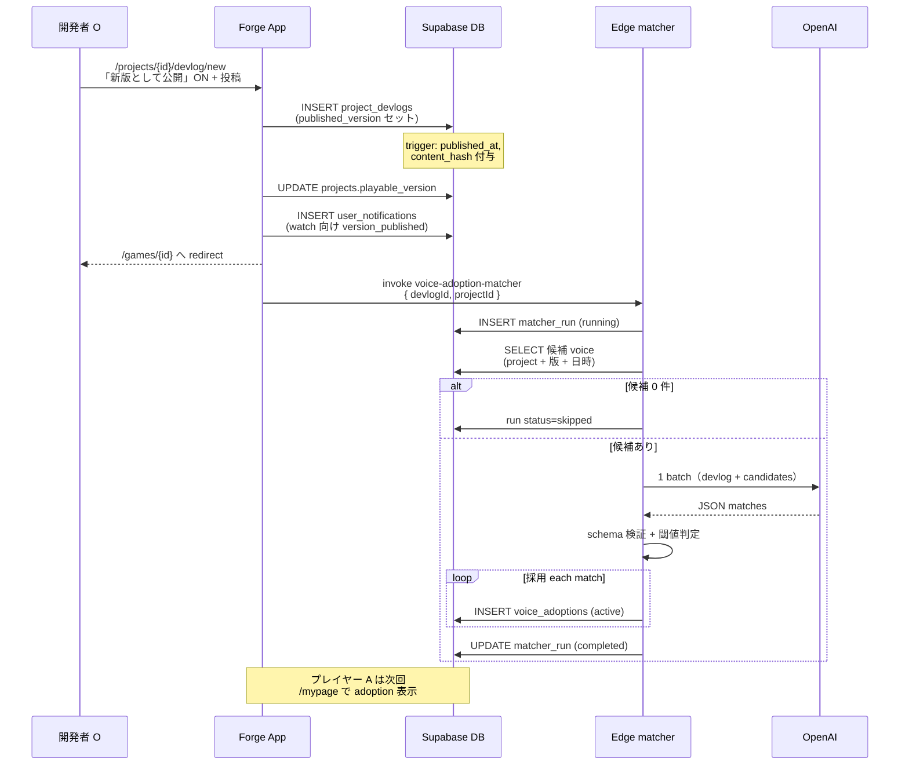

# OpenAI matcher 詳細設計 + Phase3 再プレイ導線（先行設計）

**ステータス**: **本番 GO**（2026-06-16 Run [A]）— Next.js API 経路。Edge live は別 Run  
**日付**: 2026-06-16  
**主テーマ**: OpenAI matcher を成立させ、「回答 → 更新 → 再プレイ」の因果をプレイヤー体験に接続する

**前提**

- migration **011 適用済み**
- Phase2 UI（`VoiceAdoptionsSection`）実装済み。**Supabase に adoption 行がなければ UX 未成立**
- RLS / immutable 確認は **副次作業**（本 doc では触れない）
- 本番 OpenAI / 本番 Edge live / 通知 / Phase3 **実装** は別 Run

**確定パラメータ（変更なし）**

- `ADOPTION_THRESHOLD = 0.82`（直接マッチ）
- `INDIRECT_ADOPTION_THRESHOLD = 0.88`（間接マッチ — **採用 GO**）
- 偽陽性 > 偽陰性
- 閾値未満・グレー → **行を作らない** / `pending_review` なし
- **indirect も通常 adoption として表示**（「可能性があります」等の弱い表現 NG）
- **抽象 update_summary**（「改善しました」のみ等）は不採用
- UI は DB の `player_quote` / `update_summary` のみ（表示時 LLM 禁止）
- **AI disclaimer**（プレイヤー向け）: `VOICE_ADOPTION_AI_DISCLAIMER` — Phase2 セクション footer に表示済み

**確定（2026-06-16 オーナー修正）**

- `voice_adoptions.update_summary` は **devlog 全体要約ではない**
- **その回答（voice）に対応する変更内容** を 1 行ずつ保存 — quote↔summary の **1 対 1**
- Phase3 CTA 現行案: **「変化を確かめる」**（将来 `{update_summary}を確かめる` に具体化可）

**正本**

- DB / UI: `docs/voice-adoptions-pre-implementation-review.md`
- 体験: `docs/player-nurture-core-experience-design-review.md`

---

## 0. なぜ matcher が主テーマか

| 状態 | プレイヤー体験 |
|------|----------------|
| **今（011 のみ）** | 器だけ。更新は見えるが「自分が育てた」は成立しない |
| **matcher 成立後** | 「自分はこう言った → 今回こう変わった」が **言語で因果** が見える |
| **Phase3 後** | 上記を **再プレイで身体確認** できる（通知より優先） |

Forge 価値の本体は **voice_adoptions 行の自動生成**。UI は既にある。

---

## 1. OpenAI matcher 詳細設計

### 1.1 実行場所

| 層 | 役割 |
|----|------|
| **Edge Function** `voice-adoption-matcher` | 本番想定の OpenAI 呼び出し口。service role INSERT |
| **Next.js** `POST /api/voice-adoption/run` | **staging 実装パス**。devlog 公開後 invoke。service role で matcher 実行 |
| Next.js アプリ | devlog 公開成功後に matcher **invoke**（非同期）。クライアントから OpenAI **直接呼ばない** |
| プレイヤー UI | DB SELECT のみ |

**ガード（本番 accidental AI 防止）**

- Edge: `VOICE_ADOPTION_MATCHER_MODE=live` **かつ** `OPENAI_API_KEY` があるときのみ OpenAI
- それ以外: `status=skipped`、adoptions 0
- Vercel 本番: `OPENAI_API_KEY` **未設定**
- `lib/voice-adoption/matcher.ts` live 本体は Edge に集約（クライアントに鍵を置かない）

### 1.2 OpenAI へ送る入力

**1 devlog 公開 = 1 API 呼び出し（batch）**。候補は SQL + アプリ側で事前絞り込みし、**最大 `VOICE_ADOPTION_MAX_CANDIDATES`（50）件** を OpenAI に送る。

**定数**: `lib/voice-adoption/constants.ts` → `VOICE_ADOPTION_MAX_CANDIDATES = 50`

**Stage A — 版・時刻フィルタ**（`filterCandidatesForDevlog`）

**Stage B — cap**（`applyVoiceAdoptionCandidateCap`）

- Stage A 後に件数 > 50 のとき、**`created_at` 降順（新しい voice 優先）** で 50 件に切り詰め
- 目的: **precision 保護**（コンテキスト肥大・ノイズ・FP リスク低減）。コスト削減は副次

#### Future Scalability Note

`candidate cap 50` は **現フェーズの precision 最適化の暫定措置**（MVP だから、ではない）。

Forge が成功し、人気作品で voice が **数百〜数千件** 規模になった場合、単純な切り捨て cap は **見直し対象**。

その段階では候補切り捨てではなく、例:

- embedding 検索
- relevance ranking
- 既採用 voice 除外
- 版差分優先

など **精度を維持したまま大量 feedback を扱う設計** へ移行を再評価する。

#### A. Devlog ブロック

| フィールド | ソース | 備考 |
|-----------|--------|------|
| `devlog_id` | `project_devlogs.id` | メタ（プロンプト内 id） |
| `project_id` | `project_devlogs.project_id` | |
| `published_version` | `published_version` | 例 `0.2` |
| `title` | `title` | |
| `content` | `content` | 最大 2000 文字で truncate |
| `published_at` | `published_at` | 候補フィルタ用（DB 列） |
| `content_hash` | `content_hash` | matcher_run に保存（再実行判定） |

#### B. 候補 voice ブロック（各 1 行）

SQL 条件（Stage A — LLM 前）:

```text
project_id = devlog.project_id
version_key ≤ devlog.published_version（playable-version 順序）
created_at < devlog.published_at（または published_at NULL 時は devlog.created_at）
→ cap: created_at 降順で最大 VOICE_ADOPTION_MAX_CANDIDATES（50）件
```

| フィールド | ソース |
|-----------|--------|
| `voice_response_id` | UUID |
| `user_id` | 非表示（プロンプトに含めない — プライバシー） |
| `prompt_text` | 開発者の質問文 |
| `answer_label` | 表示ラベル（あれば優先） |
| `answer_value` | 内部値 |
| `version_key` | 回答時のプレイ可能版 |
| `created_at` | 回答日時 |

**送らないもの**: 他プレイヤーの回答集計、ランキング、開発者メモ。

### 1.3 OpenAI から返す JSON

Structured Outputs（JSON Schema 厳格）。1 レスポンス = 1 devlog 分。**トップレベルの devlog 要約は返さない**。

```json
{
  "matches": [
    {
      "voice_response_id": "uuid-A",
      "related": true,
      "match_type": "indirect",
      "confidence": 0.89,
      "player_quote": "テンポが悪い",
      "update_summary": "序盤の待ち時間を短縮",
      "reason": "devlogが待ち時間短縮と明記。テンポ改善と合理的に対応"
    },
    {
      "voice_response_id": "uuid-B",
      "related": true,
      "match_type": "direct",
      "confidence": 0.91,
      "player_quote": "チュートリアルが欲しい",
      "update_summary": "チュートリアルを追加",
      "reason": "devlog本文にチュートリアル追加が明記"
    },
    {
      "voice_response_id": "uuid-C",
      "related": false,
      "match_type": "none",
      "confidence": 0.15,
      "player_quote": "BGMがうるさい",
      "update_summary": "",
      "reason": "devlogに音楽変更の記述なし"
    }
  ]
}
```

| フィールド | 用途 |
|-----------|------|
| `update_summary` | **その voice 回答に対応する変更**（max 40 字目安）。devlog 全体の要約 **禁止** |
| `related` | 採用候補か |
| `match_type` | `direct` / `indirect` / `none` — 閾値・監査用 |
| `confidence` | 0–1 |
| `player_quote` | UI 表示用（回答から短く） |
| `reason` | **監査のみ**。UI に出さない |

**NG 例（devlog に複数変更がある場合）**

```text
devlog: 「チュートリアル追加。序盤ボスHP 30%削減。UI整理。」

voice「テンポが悪い」→ update_summary: 「序盤の待ち時間を短縮」  OK
voice「チュートリアルが欲しい」→ update_summary: 「チュートリアルを追加」  OK

NG: 両方に update_summary: 「チュートリアル追加と序盤調整」  ← 全体要約
```

**採用条件（Edge 内）**

```text
related = true
AND update_summary が非空（具体変更のみ）
AND (
  (match_type = direct AND confidence >= 0.82)
  OR
  (match_type = indirect AND confidence >= 0.88)
)
AND NOT EXISTS (voice_response_id, devlog_id)
→ INSERT voice_adoptions（player_quote + update_summary は match ごと）
```

**間接マッチ方針（オーナー確定 2026-06-15）**

| 種別 | 例 | 採用条件 |
|------|-----|----------|
| **direct** | 「チュートリアルが欲しい」↔ devlog「チュートリアル追加」 | confidence ≥ **0.82** |
| **indirect** | 「テンポが悪い」↔ devlog「序盤の待ち時間を短縮」 | devlog に **具体変更** が明記 + confidence ≥ **0.88**。プレイヤー UI では direct と同じ adoption 表示 |
| **不可** | 「テンポが悪い」↔ devlog「全体的に改善しました」 | 具体性なし → 不採用（`isAbstractUpdateSummary`） |
| **不可** | 称賛のみ / 無関係機能 | related=false |
| **不可** | update_summary に「可能性があります」等 | 弱い表現パターンで reject |

**理由（オーナー）**: Forge の価値は「俺が言ったことが変わった」。indirect のみ不採用だと自由記述のヒット率が低く「採用されないからやめよう」学習が起きる。偽陽性は dispute + disclaimer で補う。

### 1.4 service role INSERT 箇所

**すべて Edge Function 内**（service role client）。クライアント / 匿名は INSERT 不可（RLS）。

```text
1. matcher_run INSERT (status=running)
2. OpenAI 呼び出し
3. JSON 検証失敗 → run status=failed, error_message, 終了
4. 各 match で採用条件を満たすものだけ voice_adoptions INSERT
5. matcher_run UPDATE:
   - candidate_count, evaluated_count, adopted_count, skipped_below_threshold
   - devlog_content_hash, model, prompt_version
   - status=completed, completed_at
```

**voice_adoptions 1 行**

| 列 | 値 |
|----|-----|
| project_id, user_id | voice 行からコピー |
| voice_response_id, devlog_id | 入力 |
| voice_version_key, published_version | voice / devlog |
| player_quote, update_summary | **同一 match オブジェクトから** — ペアで 1 対 1 |
| prompt_text | voice.prompt_text |
| confidence, model, model_version | OpenAI メタ |
| matcher_run_id | 手順 1 の id |
| status | `active` |

### 1.5 matcher_runs の利用方法

| 用途 | フィールド |
|------|-----------|
| **Idempotency** | UNIQUE `(devlog_id, trigger_type, trigger_version)` — 同一 devlog + matcher-v1 は 1 回 |
| **監査** | `started_at`, `completed_at`, `model`, `prompt_version` |
| **精度計測** | `candidate_count`, `evaluated_count`, `adopted_count`, `skipped_below_threshold` |
| **immutable 連携** | `devlog_content_hash` — devlog 本文変更後の再マッチ禁止（新 devlog のみ） |
| **失敗追跡** | `status=failed`, `error_message` |
| **Studio 将来** | オーナー SELECT で「今回の公開で N 件の声が反映」 |

**trigger_type**

| 値 | いつ |
|----|------|
| `devlog_published` | 通常。devlog 初回 `published_version` セット時 |
| `backfill` | 運用。過去 devlog の一括（別 Run） |
| `model_upgrade` | プロンプト / モデル変更後の意図的再実行（suppressed 以外は維持） |

**再実行禁止**: 同一 devlog + 同一 `trigger_version` の自動再実行。dispute 後も **自動再マッチしない**。

---

## 2. devlog 公開 → matcher 実行シーケンス



### 時系列（開発者視点）

1. **開発者** Studio で修正完了 → devlog 新規作成画面
2. **チェック「新版として公開」** → タイトル・本文入力 → 投稿
3. **DB** devlog 行作成 + `published_at` / `content_hash` + playable_version bump
4. **既存** watch プレイヤーへ `version_published` 通知（**個人引用なし** — 今後も通知優先度は低）
5. **新規** Edge invoke（非同期。失敗しても devlog 公開は成功のまま）
6. **matcher** 候補 voice を集め OpenAI 1 回 → 閾値以上のみ `voice_adoptions`
7. **プレイヤー A** 次に `/mypage` を開くと Phase2 セクションに quote↔summary 表示
8. **まだない** Phase3: 「変化を確かめる」の personal 再プレイ文脈

**失敗時 UX**: matcher 失敗 → adoption 0 件 → セクション非表示。devlog / 新版公開は成功。**サイレント**（謝罪通知なし）。

---

## 3. プロンプト案（全文）

### 3.1 System

```text
You are Forge's voice-to-update matcher. Forge connects player feedback to developer devlogs.

Rules:
- Output JSON only, matching the provided schema.
- Be conservative: related=true only when the devlog clearly addresses the player's concern.
- For EACH candidate, return player_quote AND update_summary as a pair.
- player_quote: short Japanese from the player's answer (max 40 characters). Use their wording.
- update_summary: short Japanese describing what changed IN THE DEVLOG that addresses THIS player's answer (max 40 characters). NOT a summary of the whole devlog.
- If the devlog mentions multiple changes, pick only the change relevant to this player's answer.
- NEVER use a whole-devlog summary like "チュートリアル追加と序盤調整" for every match.
- NEVER use vague phrases alone in update_summary, such as "反映されました", "改善しました", "対応しました".
- If related=false, set update_summary to empty string "".
- match_type:
  - direct: the devlog explicitly mentions the same topic as the answer (e.g. tutorial, boss, UI text).
  - indirect: the devlog describes a concrete change that plausibly addresses the player's concern, even if words differ (e.g. player "テンポが悪い" and devlog "序盤の待ち時間を短縮"). Requires explicit change in devlog body.
  - none: unrelated, praise-only, or devlog too vague to link.
- For indirect matches, require higher confidence (>=0.88) and explain the causal chain in reason.
- For direct matches, confidence >=0.82 only when you would show this to the player without embarrassment.
- If unsure, set related=false.
```

### 3.2 User（テンプレート）

```text
## Update (version {published_version})
devlog_id: {devlog_id}
Title: {title}
Body:
{content up to 2000 chars}

## Player answers ({candidate_count} items)
Each item may or may not relate to this update.

{for each candidate}
---
id: {voice_response_id}
question: {prompt_text}
answer: {answer_label ?? answer_value}
played_version: {version_key}
answered_at: {created_at ISO}
---

Return one match object per candidate id listed above. Each match must include player_quote and update_summary as a pair.
```

### 3.3 1 対 1 ペアの例

**devlog**（複数変更あり）: 「チュートリアルを追加しました。序盤の待ち時間を30%短縮しました。」

| voice | player_quote | update_summary（OK） |
|-------|--------------|----------------------|
| A | テンポが悪い | 序盤の待ち時間を短縮 |
| B | チュートリアルが欲しい | チュートリアルを追加 |

**間接マッチ JSON 例（voice A）**

```json
{
  "voice_response_id": "...",
  "related": true,
  "match_type": "indirect",
  "confidence": 0.89,
  "player_quote": "テンポが悪い",
  "update_summary": "序盤の待ち時間を短縮",
  "reason": "待ち時間短縮はテンポ改善として合理的。devlogに具体%記載"
}
```

**拒否例**

- 回答「テンポが悪い」+ devlog「バグ修正と調整を行いました」→ related=false（具体性不足）

### 3.4 モデル

- **staging 推奨**: `gpt-4o-mini`（structured outputs、コスト低）
- **prompt_version**: `adoption-prompt-v1`
- **trigger_version**: `matcher-v1`

---

## 4. staging 精度評価方法（実 Forge データ）

10 ペア fixture は **実装 smoke** のみ。本番 GO は **実データ labeled set** で判断。

### 4.1 評価セットの作り方

1. 過去の **実 devlog 公開**（`published_version` あり）を 10〜20 件ピックアップ
2. 各 devlog について、SQL で候補 voice を抽出
3. **オーナーが手動ラベル**（should_adopt: true/false）を付与  
   - 関連あり / 無関連 / グレー（採用したくない間接）
4. 合計 **30〜50 labeled ペア** を目標（devlog あたり 2〜5 回答）

**ラベルシート列**: devlog_id, voice_response_id, player_quote 原文, **expected_update_summary**, devlog 抜粋, should_adopt, match_type 期待, メモ

### 4.2 実行方法

| 段階 | 方法 |
|------|------|
| **Shadow** | Edge を invoke するが UI は fixture または feature flag off。adoptions は staging DB に INSERT 可 |
| **Offline replay** | 過去 devlog + voice を JSON 入力として Edge / スクリプト再実行（本番 voice 変更なし） |
| **Live staging** | staging 作品で新版公開 2〜3 回。オーナーがラベルと突合 |

### 4.3 precision / recall 基準（オーナー確定 2026-06-15）

**labeled set**: direct 20 + indirect 20 + reject 20 = **60 件**  
正本: `lib/voice-adoption/staging-labeled-set/`  
手順: `docs/voice-adoptions-staging-precision-guide.md`

| 評価軸 | 内容 |
|--------|------|
| **① False Positive** | **最重要**。direct / indirect / reject 各 **FP = 0** |
| **② Explanation Quality** | 採用文言目視。「自分の声と変更が関係ある」と思えるか |
| **③ Recall** | 見逃し許容。precision 優先 |

**Forge で最悪**: 「あなたの声が反映されました」が **嘘** になること。

| 指標 | staging GO | 本番 GO |
|------|------------|---------|
| **precision（FP）** | labeled 60 で **各カテゴリ FP 0** | 同上 + shadow 2 公開 FP 0 連続 |
| **recall** | **参考のみ**（低下 OK） | **≥ 40% 参考**（阻害しない） |
| **Explanation Quality** | 採用ケース目視 OK | 同左 |
| **dispute 率** | — | 導入 2 週間 **< 5%** of active adoptions |

**本番 GO の追加条件**

- staging `--live` で labeled 60 FP 0 + Explanation Quality OK
- staging shadow で **偽陽性 0** を 2 回連続公開で確認
- Edge Secrets: staging live 後、本番 deploy は **別 Run**

**recall / FN が低いとき（オーナー確定）**

- **閾値は維持**（direct 0.82 / indirect 0.88）
- 対応順: **prompt 改善** → explanation 生成改善 → labeled set 追加 → **閾値変更（最後）**
- 閾値緩和で recall を取りに行かない

### 4.4 fixture 10 ペアとの関係

| セット | 目的 |
|--------|------|
| fixture 10 | CI / 決定論 regression |
| **labeled 60** | **staging / 本番 GO 判断**（direct 20 + indirect 20 + reject 20） |

---

## 5. Phase3 再プレイ導線（先行設計・実装不要）

**方針**: 通知より **再プレイ体験** を優先。Phase2 カードから「変化を確かめる」で因果を閉じる。

### 5.1 プレイヤーが感じる流れ

```text
① マイページ / 作品詳細
   「あなたは『テンポが悪い』と答えました」
        ↓
   「今回『序盤の待ち時間を短縮』されました」

② [変化を確かめる]  ← Phase3 primary CTA（現行案）

③ 作品ページ（personal 文脈付き）
   バナー: 「前回のあなたの声: 『テンポが悪い』→ 今回: 『序盤の待ち時間を短縮』。
            版 0.3 で、変わったか確かめに行きましょう。」
   [プレイして確認する]

④ プレイ中
   （将来: 該当箇所の変化に気づく — ゲーム側 hook は MVP 外）

⑤ プレイ後
   既存 voice フロー（新版向け回答）— Phase3 では文言のみ「前回の変更を確かめたあと、新版への感想をどうぞ」程度
```

### 5.2 URL / 接続（設計）

| 要素 | 案 |
|------|-----|
| Phase2 CTA href | `/games/{projectId}?adoption={adoptionId}` |
| スクロール | `#adoption-verify` または既存 `#new-playable-version-banner` |
| 状態 | adoptionId から DB 読み quote/summary（**LLM 禁止**） |
| バナー | `NewPlayableVersionBanner` の上に **AdoptionVerifyBanner**（新規。Phase3 実装） |
| 汎用バナー | adoption コンテキストがあるときは **非表示 or 下に折りたたみ** |

### 5.3 文言（確定案）

**Phase2 カード primary（現状）**

- 「もう一度プレイする」

**Phase3 primary CTA（現行案・オーナー GO）**

- **「変化を確かめる」** — `ADOPTION_VERIFY_CTA_DEFAULT`

**Phase3 primary CTA（将来・具体化）**

- `buildAdoptionVerifyCta(update_summary)` → 例: **「チュートリアル追加を確かめる」**
- 実装: `lib/voice-adoption/constants.ts` に helper 予約済み。Phase3 で CTA に接続

**AdoptionVerifyBanner（作品詳細）**

```text
見出し: あなたの声が、今回の更新に届いています

あなたは「{player_quote}」と答えました。
今回の更新で「{update_summary}」されました。

版 {published_version} で、変わったか確かめに行きましょう。

[変化を確かめる]
```

**PlayLaunchDialog（adoption コンテキスト時）**

```text
タイトル: 版 {version} をプレイ
本文: 「{player_quote}」と答えた点について、「{update_summary}」が本当に変わっているか確かめましょう。
```

### 5.4 通知との優先順位

| チャネル | Phase2+3 | 内容 |
|----------|----------|------|
| **マイページ adoption セクション** | Primary | 因果ペア + 変化を確かめる |
| **作品詳細 personal バナー** | Secondary | 再プレイ直前 |
| **version_published 通知** | 既存維持 | 汎用「新版あり」。**personal 引用は Phase3 後も入れない**（別 Run） |
| **voice_adopted 通知** | **Out** | 再プレイ hook 成立後に検討 |

### 5.5 Phase3 実装スコープ（将来）

- `AdoptionVerifyBanner` コンポーネント
- `?adoption=` クエリ処理 + invalid id は無視
- CTA 文言変更 + `project-nurture-links` に `adoptionVerifyHref(adoptionId, projectId)`
- PlayLaunchDialog contextual copy
- **Out**: ゲーム内ハイライト、通知、レジャー

### 5.6 UX 上の「育てた」成立点

| フェーズ | プレイヤーの内側の言葉 |
|----------|------------------------|
| matcher 前 | 「更新はあった」 |
| Phase2 | 「自分が言ったことが、更新説明と対になって見える」 |
| Phase3 | 「自分の目で、ゲームの中で変わったのを確認した」 |

**Phase3 がないと**: 因果は **読んだだけ** で、最強の帰属（再プレイ中）が欠ける。

---

## 6. 次 Cursor 実装順（GO 後）

1. Edge live matcher（§1 + §3）
2. devlog 公開 → invoke（§2）
3. staging labeled set 作成支援スクリプト
4. staging shadow 精度（§4）
5. fixture off + UI 接続確認
6. Phase3 実装（別 GO）

---

## 7. オーナー判断（確定 / 残論点）

**確定（2026-06-16）**

- [x] `update_summary` = **回答ごとの対応変更**（devlog 全体要約 NG）
- [x] Phase3 CTA = **「変化を確かめる」**（将来 `{update_summary}を確かめる`）
- [x] **indirect 採用 GO** — confidence ≥ **0.88** + devlog 具体記述必須
- [x] indirect も **通常 adoption 表示**（弱い表現 NG）
- [x] **AI disclaimer** 文言確定 — UI footer に表示（`VOICE_ADOPTION_AI_DISCLAIMER`）
- [x] **バッジ構想 GO** — 設計のみ（`docs/player-badges-design-review.md`）。実装は matcher → Phase3 → 履歴 の後
- [x] 優先順位: matcher → Phase3 → 履歴 → バッジ設計 → バッジ実装

**残論点**

1. **本番 recall 40%** — staging 実データで許容下限確認
2. **Edge deploy** — staging は Next API パスで先行。本番 Edge は別 Run

---

## 関連 doc

- `docs/voice-adoptions-post-011-verification.md` — 011 適用後確認（副次）
- `docs/voice-adoptions-staging-fixture-guide.md` — fixture smoke
- `docs/player-badges-design-review.md` — バッジ設計（実装前）
